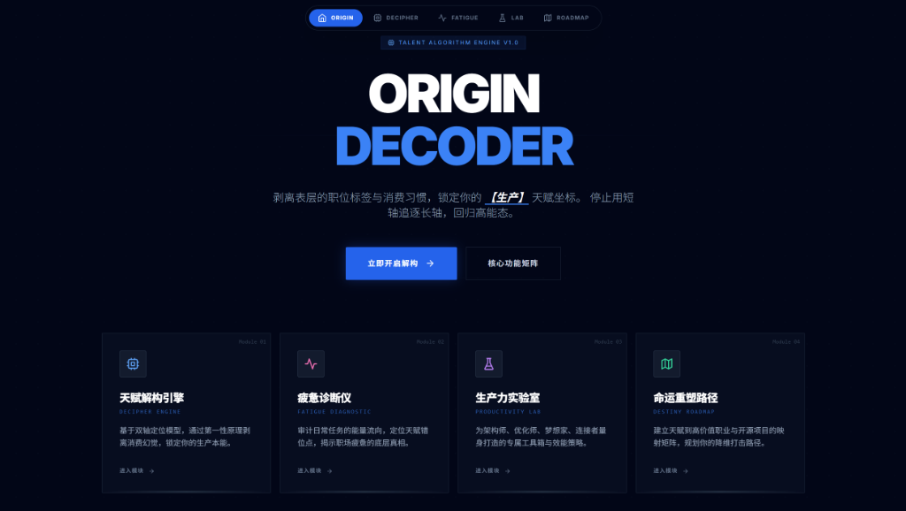

# 🌌 ORIGIN DECODER: The Talent Algorithm Engine

<p align="center">
  
</p>

<p align="center">
  <a href="https://github.com/1822520752/origin-decoder/blob/main/LICENSE">
    
  </a>
  
  
  
</p>

<p align="center">
  <a href="https://1822520752.github.io/origin-decoder/" target="_blank">
    
  </a>
</p>

---

## 🌟 Overview / 项目概述

**English:**  
Most people spend 80% of their lives filling emptiness with consumption, never discovering their true **Production Talent**. They feel exhausted at work because they are chasing "Long Axis" standards with their "Short Axis."  
**ORIGIN DECODER** is a first-principles engine designed to deconstruct your innate talent. It peels away external labels and consumption habits to lock onto your core **Production Coordinates**.

**中文：**  
很多人 80% 的人生都在用消费填补空虚，从未思考过自己的**生产天赋**。他们在职场中感到疲惫，本质是因为在用自己的“短轴”去追逐标准的“长轴”。  
**ORIGIN DECODER** 是一款基于第一性原理打造的引擎，旨在解构你的本源天赋。它通过剥离外部评价标签与消费习惯，精准锁定你的核心**生产坐标**。

> **"When you become yourself, you are the most powerful productivity."**  
> **“当你做回自己时，你才是最强大的生产力。”**

---

## 🧠 The First Principles / 核心逻辑

We define how you interact with the world through two fundamental axes:  
我们认为，你与万物互动的方式本质上由两个坐标轴决定：

1.  **Energy Flow (Creation vs. Iteration) / 能量流向 (开创 vs. 迭代)**  
    *   **Creation**: High openness, thrive on "0 to 1" innovation.
    *   **Iteration**: Pragmatic, thrive on "1 to 100" refinement.
2.  **Attention Core (Logic vs. Feeling) / 关注内核 (逻辑 vs. 感受)**  
    *   **Logic**: Understand the world through structures, efficiency, and laws.
    *   **Feeling**: Understand the world through resonance, connections, and energy.

### 🏛️ The Four Talent Systems / 四大天赋系统
-   **Architect (架构师)**: [Logic + Creation] —— The Lawmaker. Builds systems and rules.
-   **Optimizer (优化师)**: [Logic + Iteration] —— The Guardian. Refines perfection and fights entropy.
-   **Visionary (梦想家)**: [Feeling + Creation] —— The Inspirer. Captures sparks and paints the future.
-   **Connector (连接者)**: [Feeling + Iteration] —— The Nurturer. Routers of information and safe harbors for emotions.

---

## 🚀 Module Matrix / 核心模块

### 01. Decipher Engine / 天赋解构引擎
*   **EN:** Immersive assessment to strip away "consumption illusions" and reveal production instincts.
*   **CN:** 沉浸式测评，剥离“消费型幻觉”，揭示你本能的生产冲动。

### 02. Fatigue Diagnostic / 疲惫诊断仪
*   **EN:** Audits daily tasks to identify "Talent Mismatch." Quantifies why you feel drained.
*   **CN:** 审计日常任务，定位“天赋错位”点。量化能量损耗，揭示疲惫真相。

### 03. Productivity Lab / 生产力实验室
*   **EN:** Tailored toolkits (Obsidian, Raycast, Midjourney) and AI strategies for each quadrant.
*   **CN:** 为不同象限量身打造的工具箱（如 Obsidian, Raycast 等）与 AI 协同策略。

### 04. Destiny Roadmap / 命运重塑路径
*   **EN:** Mapping matrix from talent to high-value careers and open-source projects.
*   **CN:** 建立从天赋到高价值职业与开源项目的映射矩阵，规划你的“降维打击”路径。

---

## 🛠️ Tech Stack / 技术栈

-   **Framework**: Next.js 14 (App Router)
-   **Language**: TypeScript
-   **Styling**: Tailwind CSS + Framer Motion (Blueprint Aesthetic)
-   **State**: Zustand + Middleware Persistence
-   **Data Viz**: Recharts (Interactive Coordinates)

---

## ⚡ Quick Start / 快速开始

```bash
# 1. Clone the repository
git clone https://github.com/1822520752/origin-decoder.git

# 2. Install dependencies
npm install # or bun install

# 3. Run development server
npm run dev
```

Open [http://localhost:3000](http://localhost:3000) to start your journey.

---

## ☁️ Deployment / 部署

**English:**  \nThis repo is pre-configured to deploy to **GitHub Pages** via GitHub Actions.\n+\n+1. Go to **Settings → Pages**\n+2. Under **Build and deployment**, choose **GitHub Actions**\n+3. Push to `main` and the workflow will publish the site automatically\n+\n+Your Pages URL (default): https://1822520752.github.io/origin-decoder/\n+\n+**中文：**  \n+本仓库已配置 **GitHub Actions 自动部署到 GitHub Pages**。\n+\n+1. 打开仓库 **Settings → Pages**\n+2. 在 **Build and deployment** 里选择 **GitHub Actions**\n+3. 代码推送到 `main` 后会自动构建并发布\n+\n+默认访问地址：https://1822520752.github.io/origin-decoder/\n+\n ---
## 🤝 Contribution / 参与贡献


We welcome contributions! Whether it's refining the talent mapping matrix or suggesting new tools for the lab, let's build the ultimate engine for human potential together.

欢迎提交 Pull Request 以完善天赋映射矩阵，或为实验室推荐新的生产力工具。让我们共同打造解构人类潜能的终极引擎。

---

<p align="center">
  <b>© 2026 ORIGIN DECODER - TALENT ALGORITHM ENGINE</b><br>
  <i>"Stop chasing long axes with your short ones. Return to your high-energy state."</i>
</p>
